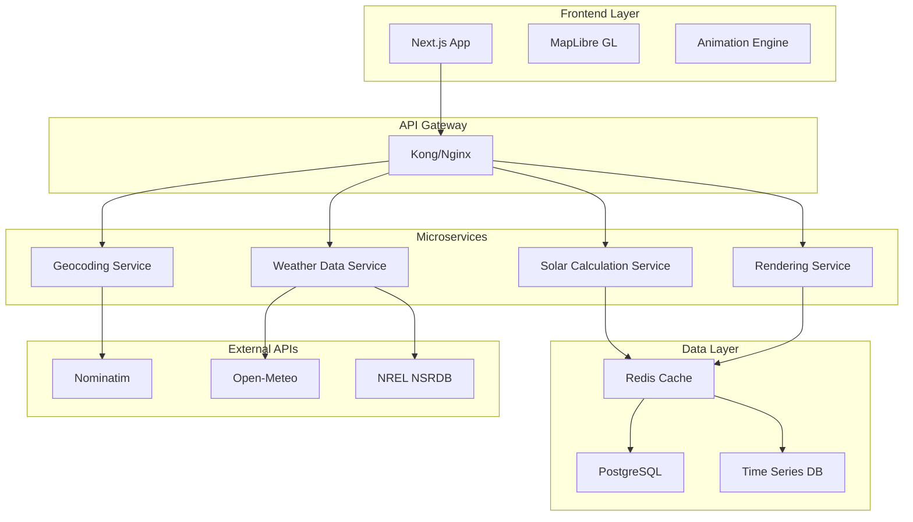
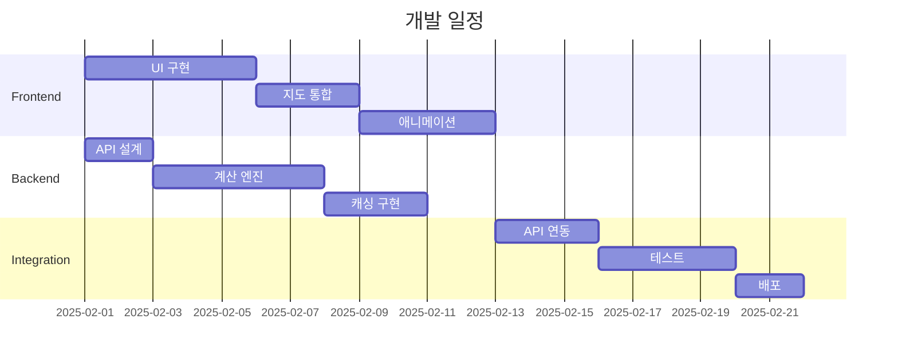

# 🌞 SunPath & Shadow Simulator — 최종 PDR (개선판)

**형태:** 하이브리드(Next.js + Python FastAPI)  
**버전:** 2.0  
**최종 수정일:** 2025-01-20

---

## 📋 목차

1. [제품 개요](#1-제품-개요)
2. [문제 정의 및 배경](#2-문제-정의-및-배경)
3. [기능 범위 (Scope)](#3-기능-범위-scope)
4. [시스템 아키텍처](#4-시스템-아키텍처)
5. [주요 기술 스택](#5-주요-기술-스택)
6. [핵심 기능 요구사항 (FRD)](#6-핵심-기능-요구사항-frd)
7. [비기능 요구사항 (NFR)](#7-비기능-요구사항-nfr)
8. [데이터 모델](#8-데이터-모델)
9. [알고리즘 및 계산 로직](#9-알고리즘-및-계산-로직)
10. [성능 최적화 전략](#10-성능-최적화-전략)
11. [테스트 전략](#11-테스트-전략)
12. [보안 요구사항](#12-보안-요구사항)
13. [개발 로드맵](#13-개발-로드맵)
14. [참조 표준 및 규정](#14-참조-표준-및-규정)

---

## 1. 제품 개요

| 항목 | 내용 |
|------|------|
| **제품명** | SunPath & Shadow (태양 경로·그림자 시뮬레이터) |
| **형태** | 웹 기반 (Next.js 프론트엔드 + Python 백엔드) |
| **주요 목적** | 위치와 날짜를 입력해 해당 위치의 일조량, 해의 움직임, 그림자 방향 및 길이를 시각적으로 확인 |
| **주요 사용자** | 병원/건축/시설 담당자, 태양광 설계자, 도시계획자, 농업 종사자, 사진작가, 일반 사용자 |
| **차별화 요소** | 실시간 애니메이션, 고정밀 계산, 다양한 사용자 시나리오 지원 |

---

## 2. 문제 정의 및 배경

### 2.1 현재 시장 상황
- **기존 솔루션의 한계**
  - 데스크톱 중심의 복잡한 CAD/BIM 도구 (높은 진입 장벽)
  - 정적 데이터(일출/일몰 시간)만 제공하는 단순 서비스
  - 전문가용 고가 소프트웨어

### 2.2 해결하고자 하는 문제
- 간단한 지도 기반의 실시간 시뮬레이터 부재
- 시간대별 그림자 시각화 도구 필요
- 다양한 사용자층을 위한 통합 플랫폼 부재

---

## 3. 기능 범위 (Scope)

### ✅ In Scope (MVP)

#### 핵심 기능
- 주소 입력 → 지오코딩 → 좌표 추출
- OSM(MapLibre) 지도 표시 및 위치 마커
- 선택 날짜의 태양 경로 계산
- 타임라인(슬라이더) 기반 동적 시뮬레이션
- 일사량 계산 및 시각화 (직달/산란/반사 구분)
- CSV/JSON 데이터 내보내기

#### 사용자 시나리오 프리셋
- **태양광 패널 설치**: 연간 최적 경사각 자동 계산
- **건축 일조권 분석**: 동지/하지 비교 모드
- **농업 일조량**: PAR(광합성 유효 복사) 표시
- **사진 촬영**: Golden Hour/Blue Hour 하이라이트

### 🚫 Out of Scope (향후 확장)

- 건물·지형 기반 3D 그림자 렌더링
- 실시간 기상 데이터 통합 (구름 영향)
- 계절별 자동 애니메이션 비교
- 모바일 AR 모드
- AI 기반 최적 위치 추천

---

## 4. 시스템 아키텍처

### 4.1 마이크로서비스 아키텍처



### 4.2 데이터 흐름

```
사용자 입력 → Next.js Frontend
    ↓
API Gateway (인증/라우팅)
    ↓
병렬 처리:
├─ Geocoding Service → 좌표 변환
├─ Solar Calculation → 태양 위치 계산
└─ Weather Service → 일사량 데이터
    ↓
캐시 레이어 (Redis)
    ↓
Response Aggregation
    ↓
Frontend Rendering
```

---

## 5. 주요 기술 스택

| 계층 | 기술 | 역할 | 선택 이유 |
|------|------|------|-----------|
| **Frontend** | Next.js 14 (App Router) | SSR + 클라이언트 컴포넌트 | SEO, 성능 최적화 |
| | MapLibre GL JS | OpenStreetMap 벡터 지도 | 오픈소스, 커스터마이징 |
| | Three.js | 3D 시각화 (선택적) | 태양 궤적 돔 렌더링 |
| | Tailwind CSS | UI 스타일링 | 빠른 개발 |
| | Recharts/D3.js | 차트 및 그래프 | 인터랙티브 시각화 |
| **Backend** | FastAPI | API 서버 | 고성능, 자동 문서화 |
| | pvlib-python | 태양 위치 계산 | NREL 검증 알고리즘 |
| | Celery | 비동기 작업 큐 | 배치 처리 |
| | SQLAlchemy | ORM | 데이터베이스 추상화 |
| **Data** | Redis | 캐싱 레이어 | 고속 응답 |
| | PostgreSQL + PostGIS | 지리공간 데이터 | 위치 기반 쿼리 |
| | TimescaleDB | 시계열 데이터 | 과거 데이터 분석 |
| **Infra** | Docker + K8s | 컨테이너화 | 확장성 |
| | Vercel/AWS | 배포 | 글로벌 CDN |
| | Prometheus + Grafana | 모니터링 | 성능 추적 |

---

## 6. 핵심 기능 요구사항 (FRD)

### 6.1 위치 및 날짜 입력

| ID | 요구사항 | 우선순위 |
|----|----------|----------|
| F1-1 | 주소 → Nominatim 지오코딩 → (위도, 경도) | P0 |
| F1-2 | 지도 클릭 시 좌표 갱신 및 주소 역지오코딩 | P1 |
| F1-3 | 날짜 선택 (기본: 오늘) + 날짜 범위 선택 | P0 |
| F1-4 | 즐겨찾기 위치 저장 (localStorage) | P2 |

### 6.2 태양 경로 및 일사량

| ID | 요구사항 | 우선순위 |
|----|----------|----------|
| F2-1 | NREL SPA 알고리즘 기반 고도/방위각 계산 | P0 |
| F2-2 | 대기 굴절 보정 적용 | P1 |
| F2-3 | 직달/산란/반사 일사량 개별 계산 | P0 |
| F2-4 | Perez Sky Model 적용 (실제 하늘 조건) | P1 |
| F2-5 | 일출/일몰 시각 및 방위각 자동 산출 | P0 |

### 6.3 그림자 계산 및 시각화

| ID | 요구사항 | 우선순위 |
|----|----------|----------|
| F3-1 | 물체 높이 입력 → 그림자 길이/방향 계산 | P0 |
| F3-2 | 태양고도 0° 근처 특별 처리 | P0 |
| F3-3 | 지형 경사도 반영 옵션 | P2 |
| F3-4 | 그림자 벡터 실시간 렌더링 | P0 |
| F3-5 | 다중 물체 그림자 동시 표시 | P2 |

### 6.4 타임라인/애니메이션

| ID | 요구사항 | 우선순위 |
|----|----------|----------|
| F4-1 | 1분/5분/15분 간격 선택 가능 | P1 |
| F4-2 | 슬라이더 실시간 업데이트 (30fps) | P0 |
| F4-3 | Play/Pause/속도 조절 (0.5x~5x) | P0 |
| F4-4 | 일출~일몰 구간 자동 재생 | P1 |
| F4-5 | 특정 시각 직접 입력 | P2 |

### 6.5 결과 표시 및 내보내기

| ID | 요구사항 | 우선순위 |
|----|----------|----------|
| F5-1 | 차트 4종 (고도/방위각/일사량/그림자) | P0 |
| F5-2 | 요약 대시보드 (주요 지표) | P0 |
| F5-3 | CSV/JSON/PDF 내보내기 | P1 |
| F5-4 | 이미지 스냅샷 저장 | P2 |
| F5-5 | 공유 가능한 URL 생성 | P2 |

---

## 7. 비기능 요구사항 (NFR)

### 7.1 성능 요구사항

| 항목 | 목표 | 측정 방법 |
|------|------|-----------|
| **응답 시간** | < 1초 (캐시 히트) / < 3초 (신규 계산) | 95th percentile |
| **애니메이션 FPS** | 30fps 이상 | Performance API |
| **동시 사용자** | 1,000명 | 부하 테스트 |
| **가용성** | 99.9% | 월간 가동률 |

### 7.2 정확도 요구사항

| 항목 | 목표 정확도 | 검증 방법 |
|------|------------|-----------|
| **태양 고도/방위각** | ±0.05° | NREL 데이터 대조 |
| **일사량 (맑은 날)** | ±5% | 기상청 관측 데이터 |
| **일사량 (흐린 날)** | ±15% | 위성 데이터 비교 |
| **그림자 길이** | ±2% | 실측 검증 |

### 7.3 사용성 요구사항

- 모바일 반응형 디자인
- WCAG 2.1 Level AA 접근성
- 5개 국어 지원 (한/영/중/일/스페인어)
- 초보자 튜토리얼 제공

---

## 8. 데이터 모델

### 8.1 입력 스키마

```typescript
interface SolarCalculationRequest {
  location: {
    lat: number;        // -90 to 90
    lon: number;        // -180 to 180
    altitude?: number;  // 고도 (m)
    timezone?: string;  // IANA timezone
  };
  datetime: {
    date: string;       // ISO 8601
    startTime?: string;
    endTime?: string;
    interval?: number;  // minutes
  };
  object?: {
    height: number;     // meters
    tilt?: number;      // degrees
    azimuth?: number;   // degrees
  };
  options?: {
    atmosphere?: boolean;     // 대기 굴절 보정
    precision?: 'low' | 'medium' | 'high';
    includeWeather?: boolean;
  };
}
```

### 8.2 출력 스키마

```typescript
interface SolarCalculationResponse {
  metadata: {
    requestId: string;
    timestamp: string;
    version: string;
    accuracy: {
      position: number;  // degrees
      irradiance: number; // percentage
    };
  };
  summary: {
    sunrise: DateTime;
    sunset: DateTime;
    solarNoon: DateTime;
    dayLength: number;  // hours
    maxAltitude: number;
    totalIrradiance: number; // kWh/m²
  };
  series: Array<{
    timestamp: string;
    sun: {
      altitude: number;
      azimuth: number;
      zenith: number;
      hourAngle: number;
    };
    irradiance: {
      ghi: number;  // Global Horizontal
      dni: number;  // Direct Normal
      dhi: number;  // Diffuse Horizontal
      par?: number; // Photosynthetically Active
    };
    shadow?: {
      length: number;
      direction: number;
      coordinates?: [number, number][];
    };
  }>;
}
```

---

## 9. 알고리즘 및 계산 로직

### 9.1 태양 위치 계산

#### NREL Solar Position Algorithm (SPA)
```python
def calculate_solar_position(lat, lon, datetime, pressure=1013.25, temp=15):
    """
    NREL SPA 구현
    정확도: ±0.0003° (2000-6000년)
    """
    # 1. Julian Date 계산
    jd = calculate_julian_date(datetime)
    
    # 2. 지구 헬리오센트릭 좌표
    L = earth_heliocentric_longitude(jd)
    B = earth_heliocentric_latitude(jd)
    R = earth_radius_vector(jd)
    
    # 3. 지구중심 좌표 변환
    theta = geocentric_longitude(L, B, R)
    beta = geocentric_latitude(B, R)
    
    # 4. 장동 및 세차 보정
    delta_psi, delta_epsilon = nutation_correction(jd)
    
    # 5. 시각 방정식
    E = equation_of_time(jd)
    
    # 6. 지평좌표 변환
    altitude = solar_altitude(lat, delta, H)
    azimuth = solar_azimuth(lat, delta, H, altitude)
    
    # 7. 대기 굴절 보정
    if altitude > -0.56:  # 수평선 아래는 보정 안 함
        refraction = atmospheric_refraction(altitude, pressure, temp)
        altitude += refraction
    
    return altitude, azimuth
```

### 9.2 그림자 계산 개선

```python
def calculate_shadow(object_height, sun_altitude, sun_azimuth, 
                    terrain_slope=0, terrain_aspect=0):
    """
    향상된 그림자 계산
    """
    # 태양 고도가 매우 낮을 때 처리
    if sun_altitude <= 0.1:
        return float('inf'), None  # 무한 그림자
    
    # 기본 그림자 길이
    shadow_length = object_height / math.tan(math.radians(sun_altitude))
    
    # 지형 경사 보정
    if terrain_slope > 0:
        slope_factor = calculate_slope_correction(
            terrain_slope, terrain_aspect, sun_azimuth
        )
        shadow_length *= slope_factor
    
    # 그림자 방향 (태양 반대)
    shadow_direction = (sun_azimuth + 180) % 360
    
    # 그림자 끝점 좌표
    shadow_end = calculate_endpoint(
        shadow_length, shadow_direction
    )
    
    return shadow_length, shadow_direction, shadow_end
```

### 9.3 일사량 모델

#### Perez Sky Model 구현
```python
def calculate_irradiance(sun_position, weather_data, surface_tilt=0):
    """
    Perez 모델 기반 일사량 계산
    """
    # Clear Sky 모델 (Ineichen)
    dni_clear = clear_sky_dni(sun_position, weather_data.aod)
    dhi_clear = clear_sky_dhi(sun_position, weather_data.aod)
    
    # 구름 영향 계수
    cloud_factor = weather_data.cloud_cover / 100
    
    # Perez 계수 계산
    f1, f2 = perez_coefficients(
        sun_position.zenith, 
        dhi_clear, 
        dni_clear
    )
    
    # 직달 일사량
    dni = dni_clear * (1 - cloud_factor * 0.75)
    
    # 산란 일사량 (등방성 + 원주 + 수평선)
    dhi_isotropic = dhi_clear * (1 + cloud_factor * 0.2)
    dhi_circumsolar = calculate_circumsolar(f1, sun_position)
    dhi_horizon = calculate_horizon_brightening(f2)
    
    dhi = dhi_isotropic + dhi_circumsolar + dhi_horizon
    
    # 전체 일사량 (경사면)
    gti = calculate_plane_irradiance(
        dni, dhi, sun_position, surface_tilt
    )
    
    return {
        'dni': dni,
        'dhi': dhi,
        'ghi': dni * cos(sun_position.zenith) + dhi,
        'gti': gti
    }
```

---

## 10. 성능 최적화 전략

### 10.1 다층 캐싱 아키텍처

```yaml
캐싱 레이어:
  L1 - Browser:
    type: localStorage/IndexedDB
    ttl: 7 days
    size: 10MB
    content: 최근 5개 위치 데이터
    
  L2 - CDN Edge:
    type: CloudFlare Workers KV
    ttl: 24 hours
    content: 인기 도시 사전계산 데이터
    strategy: Geographic distribution
    
  L3 - Application:
    type: Redis Cluster
    ttl: 6 hours
    eviction: LRU
    key_pattern: "{lat:2dp}_{lon:2dp}_{date}_{height}"
    
  L4 - Database:
    type: PostgreSQL Materialized Views
    refresh: Daily
    content: 과거 계산 결과 집계
```

### 10.2 계산 최적화

```python
# 벡터화 연산 (NumPy)
def batch_calculate_positions(times, location):
    """
    시계열 일괄 계산
    """
    # 벡터화된 Julian Date
    jd_array = np.array([julian_date(t) for t in times])
    
    # SIMD 연산 활용
    positions = spa_vectorized(
        jd_array, 
        location.lat, 
        location.lon
    )
    
    return positions

# 병렬 처리 (Dask)
@dask.delayed
def parallel_irradiance(chunk):
    return calculate_irradiance_chunk(chunk)
```

### 10.3 네트워크 최적화

- **압축**: Brotli 압축 (30% 향상)
- **스트리밍**: Server-Sent Events (실시간 업데이트)
- **배치 요청**: GraphQL 통합
- **프리페칭**: 인접 날짜 미리 계산

---

## 11. 테스트 전략

### 11.1 단위 테스트

```python
class TestSolarCalculations:
    """핵심 알고리즘 테스트"""
    
    def test_extreme_latitudes(self):
        # 북극/남극
        assert calculate_position(90, 0, "2025-06-21")
        assert calculate_position(-90, 0, "2025-12-21")
    
    def test_date_boundaries(self):
        # 윤년, 서머타임
        assert handle_leap_year("2024-02-29")
        assert handle_dst_transition("2025-03-09")
    
    def test_numerical_precision(self):
        # 부동소수점 정밀도
        result = calculate_with_precision(
            lat=37.123456789,
            lon=126.987654321
        )
        assert abs(result.altitude - expected) < 0.0001
```

### 11.2 통합 테스트

```yaml
테스트 시나리오:
  - name: "글로벌 도시 검증"
    cities: ["서울", "뉴욕", "런던", "시드니", "상파울루"]
    dates: ["동지", "하지", "춘분", "추분"]
    validation: NREL_NSRDB_데이터
    
  - name: "성능 부하 테스트"
    concurrent_users: 1000
    duration: 60min
    metrics:
      - response_time_p95 < 2s
      - error_rate < 0.1%
      - cpu_usage < 80%
```

### 11.3 E2E 테스트

```javascript
// Playwright E2E
test('complete user journey', async ({ page }) => {
  // 1. 위치 검색
  await page.goto('/');
  await page.fill('#address', '서울특별시 중구');
  await page.click('#search');
  
  // 2. 날짜 선택
  await page.selectDate('2025-06-21');
  
  // 3. 애니메이션 실행
  await page.click('#play');
  await page.waitForAnimation();
  
  // 4. 결과 검증
  const shadow = await page.locator('#shadow-length');
  expect(await shadow.textContent()).toMatch(/\d+\.?\d* m/);
});
```

---

## 12. 보안 요구사항

### 12.1 API 보안

```yaml
security:
  authentication:
    type: JWT
    expiry: 1hour
    refresh: 7days
    
  rate_limiting:
    anonymous: 60/min
    authenticated: 300/min
    premium: 1000/min
    
  input_validation:
    latitude: [-90, 90]
    longitude: [-180, 180]
    date: ISO_8601
    height: [0, 1000]  # meters
    
  cors:
    origins: ["https://sunpath.app"]
    methods: ["GET", "POST"]
    
  encryption:
    transport: TLS_1.3
    storage: AES_256_GCM
```

### 12.2 데이터 보호

- PII 미수집 원칙
- IP 주소 해싱 저장
- GDPR/CCPA 준수
- 로그 30일 후 자동 삭제

---

## 13. 개발 로드맵

### Phase 1: MVP (4주)



### Phase 2: 고급 기능 (4주)
- Perez Sky Model 구현
- 사용자 프리셋 시스템
- 배치 계산 API
- 성능 최적화

### Phase 3: 엔터프라이즈 (8주)
- 3D 그림자 렌더링
- AI 기반 최적화
- 화이트 라벨링
- SLA 보장

---

## 14. 참조 표준 및 규정

### 14.1 기술 표준

| 표준 | 설명 | 적용 영역 |
|------|------|-----------|
| **ISO 9060:2018** | 일사량 측정 표준 | 센서 데이터 검증 |
| **WMO No. 8** | 기상 관측 지침 | 기상 데이터 처리 |
| **ASHRAE 90.1** | 건물 에너지 표준 | 건축 일조 분석 |
| **IEC 61724-1** | PV 시스템 성능 | 태양광 효율 계산 |
| **CIE S 011/E:2003** | 표준 하늘 모델 | 조도 계산 |

### 14.2 데이터 라이선스

- **OpenStreetMap**: ODbL 1.0
- **Open-Meteo**: CC BY 4.0
- **NREL NSRDB**: Public Domain
- **pvlib-python**: BSD 3-Clause

### 14.3 인용 요구사항

```bibtex
@software{pvlib_python,
  author = {Holmgren, W. F. and Hansen, C. W. and Mikofski, M. A.},
  title = {pvlib python: a python package for modeling solar energy systems},
  journal = {Journal of Open Source Software},
  year = {2018},
  volume = {3},
  number = {29},
  pages = {884},
  doi = {10.21105/joss.00884}
}
```

---

## 📎 부록

### A. 용어 정의

| 용어 | 설명 |
|------|------|
| **GHI** | Global Horizontal Irradiance (수평면 전일사량) |
| **DNI** | Direct Normal Irradiance (직달 일사량) |
| **DHI** | Diffuse Horizontal Irradiance (산란 일사량) |
| **SPA** | Solar Position Algorithm |
| **AOD** | Aerosol Optical Depth (에어로졸 광학 깊이) |
| **PAR** | Photosynthetically Active Radiation |

### B. 참고 자료

1. [NREL Solar Position Algorithm](https://www.nrel.gov/docs/fy08osti/34302.pdf)
2. [Perez Sky Diffuse Model](https://www.sciencedirect.com/science/article/pii/0038092X87900315)
3. [pvlib Documentation](https://pvlib-python.readthedocs.io/)
4. [Open-Meteo API](https://open-meteo.com/en/docs)

---

**문서 버전 관리**

| 버전 | 날짜 | 작성자 | 변경 내용 |
|------|------|--------|-----------|
| 1.0 | 2025-10-20 | 초기 작성 | 기본 PDR 작성 |